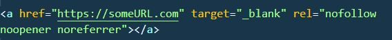
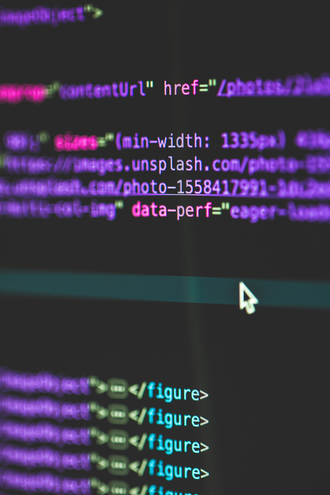
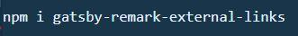
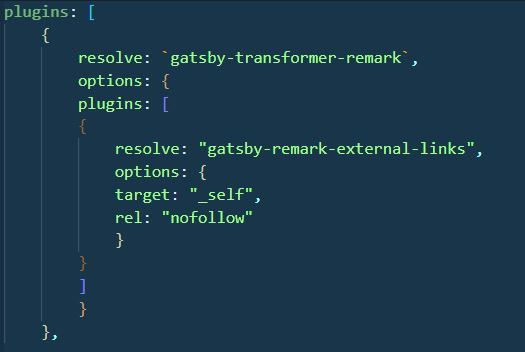
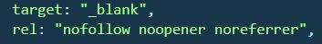
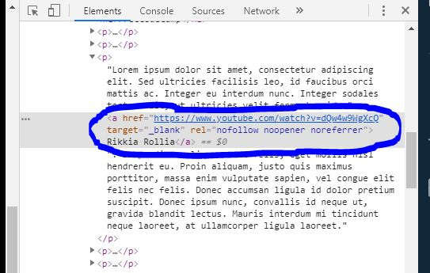

_Photo by [Mike Alonzo][1] on [Unsplash][2]_

What's that?

You find it awkward that external links in your [Gatsby starter blog](https://www.gatsbyjs.org/starters/gatsbyjs/gatsby-starter-blog/) open in the same tab? Oh, and its irritating that when you hit the back button, you return to the blog but _AT THE TOP OF THE POST INSTEAD OF WHERE YOU LEFT OFF?!?_

I hear you!

Well there are a couple of things we could do. We could find a way to have it return to the text section that contains the link, or we could just set it up to open in a new tab. I like the latter. Let's do that.

# How Do I Do That?

_Photo by [Melanie Dretvic][3] on [Unsplash][2]_

Read on, or [Skip to Instructions](#instructions)

Since the blog posts are markdown documents, we somehow have to set this html attribute `target="_blank"` on our anchor tags, and for [security reasons that you can read about](https://www.jitbit.com/alexblog/256-targetblank---the-most-underestimated-vulnerability-ever/), we should also set the rel attribute to `rel="noopener noreferrer nofollow"`.

Let me just say this straight up:

There is no easy way to set these attributes using pure markdown. Every👏single👏time👏, you would have to insert an inline html element in your document.

Something like this:

What's that you say? The point of markdown is to write code quickly by not writing full html tags?

Exactly. 🙄 So let's not do that.

Instead, lets install a node package that helps us automatically add these attributes to the gatsby-generated html at runtime.

All we have to do is write a standard markdown external link like this: `[FreeCodeCamp](https://www.freecodecamp.org/)`. The magic javascript in the package does the rest.

#Instructions

_Photo by [Mark Spiske][4] on [Unsplash][2]_

These instructions assume you are using some variation on the [Gatsby starter blog](https://www.gatsbyjs.org/starters/gatsbyjs/gatsby-starter-blog/).

1. In your root folder, install the[ gatsby-remark-external-links package](https://www.npmjs.com/package/gatsby-remark-external-links).

2. You'll need to add the following config items to your gatsby-config.js file. Chances are, your config file already contains the 'gatsby-transformer-remark' resolver. So just plunk the 'gatsby-remark-external-links' portion in there.

3. Change the config file options object to say:

4.  CRITICAL:

    In your terminal, you need to _restart your development server for the config changes to take effect._ So, hit ctrl-c if it's already running, then type "gatsby develop" to restart the server. The new plugin should be active now.

# How Do I Know It's Working?

Open a markdown file in your blog folder. Use some lorem ipsum text, or whatever you like, and include a test link, like this:

_Lorem ipsum dolor sit amet, consectetur adipiscing elit. Sed ultricies facilisis leo, id faucibus orci mattis ac. Integer eu interdum nunc. Integer sodales tortor elit, ut ultricies velit fermentum id._ `[Rikkia Rollia](https://www.youtube.com/watch?v=dQw4w9WgXcQ).` _Suspendisse aliquam nunc felis, eget mollis nisl hendrerit eu. Proin aliquam, justo quis maximus porttitor, massa enim vulputate sapien, vel congue elit felis nec felis._

In a new chrome tab, open localhost:8000. Your blog should be running. Find your test link in the text and right-click inspect on it.

In chrome dev tools you should be able to see the 'target' and 'rel' attributes already added.

Yes! Now, if you click the link, it'll safely open in a new tab and you won't lose your place in the blogpost.

All this, and we didn't even have to pollute our markdown with html tags! Outstanding!

Happy blogging!

[1]: https://unsplash.com/@mikezo?utm_source=unsplash&utm_medium=referral&utm_content=creditCopyText
[2]: https://unsplash.com/?utm_source=medium&utm_medium=referral
[3]: https://unsplash.com/@designwilde?utm_source=unsplash&utm_medium=referral&utm_content=creditCopyText
[4]: https://unsplash.com/@markusspiske?utm_source=unsplash&utm_medium=referral&utm_content=creditCopyText
