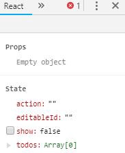
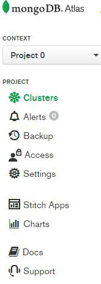
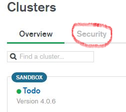
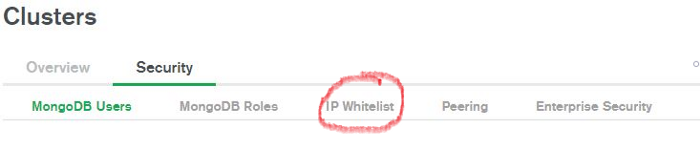
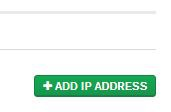
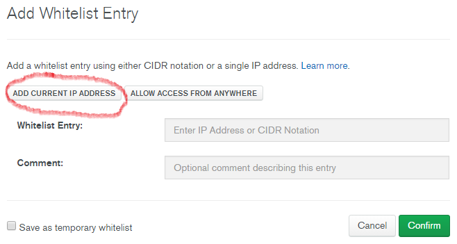

> _This tiny article tells how to quickly and easily fix a MongoDB connection error by adding your IP address to a whitelist in your Mongo Atlas account. Hopefully, this will save you a little time and grief._

[Skip to Instructions](#instructions)

_Photo by [Campaign Creators][1] on [Unsplash][2]_

# A Little Context

I created a basic React Todo CRUD app with a MongoDB back end. Everything was working fine when I left it.

When I came back, I ran the ‘npm run dev’ script which, among other things, should connect to my database and run the local development server.

The database did not connect and thus the app couldn’t retrieve my list of persisted todos.

When I opened React dev tools, I could see within my state object that the todos array was indeed empty:

#I Assumed I Was the Problem

Of course, being fairly new to coding (2 yrs experience), I assumed that I had broken some code during my last work session. Turns out, that wasn’t the case at all.
I examined closely any code that I had recently edited. I found no errors.
The console gave some vague indication that Mongo couldn’t connect via the standard port 27017.
Checked my schema and routes. A-ok.
I checked my .env file to make sure I was contacting the correct uri. No problem there.
I spent an hour working this problem. Ugh.

#So What was the Problem?

The solution was simple.

A _power outage_ had shut down my computer and broadband router the night previous. When they rebooted, for whatever reason,_ my IP address had changed slightly_ (it happens!). I had never encountered this problem before because, unbelievably, my router and computer had not been powered down in the 2 weeks since I’d created the app (unbelievable, since power outages are fairly frequent in rural Ontario).

Your Mongo Atlas account contains a whitelist of IP addresses that are authorized to access your data clusters. _To fix the connection error, I simply had to update the whitelist to include my most recent IP address._

#Instructions to Fix the Problem:

1. Login to your Mongo Atlas account.

2. Choose ‘clusters’

3. Click on ‘security’ tab

4. Choose ‘IP Whitelist’ tab

5. Click the ‘add IP address’ button

6. Either click the ‘add current IP address’ button or enter one manually.

7. Click ‘confirm’ and VOILA! When you next run your development server, you should be connected to your database.

Hopefully this works for you and saves you some precious time.

[1]: https://unsplash.com/@campaign_creators?utm_source=medium&utm_medium=referral
[2]: https://unsplash.com/?utm_source=medium&utm_medium=referral
